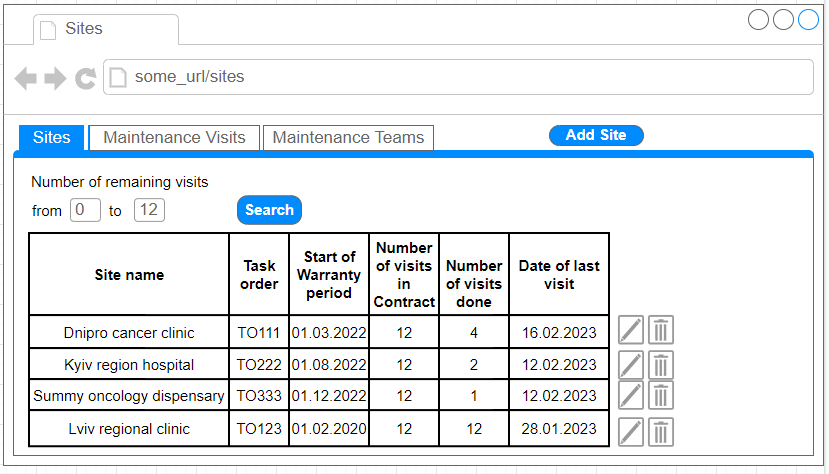
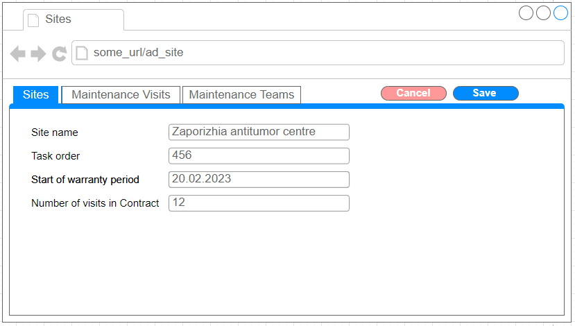
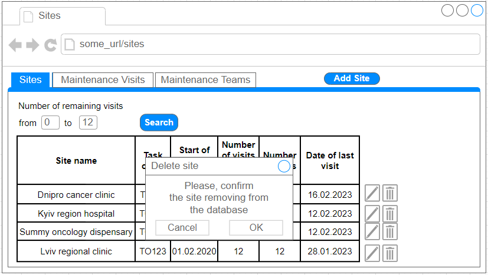
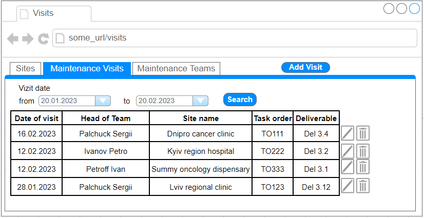
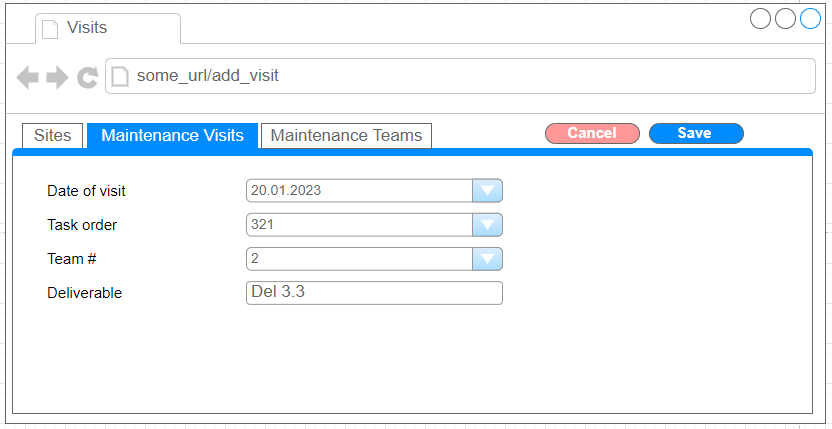
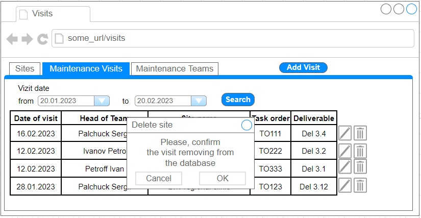
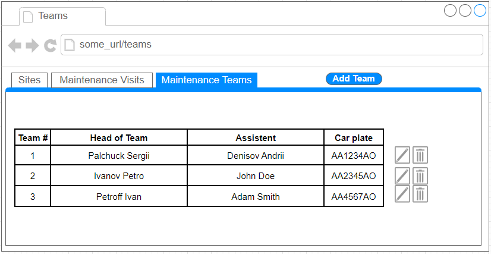
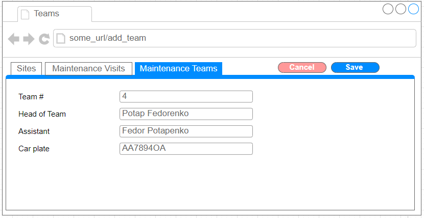
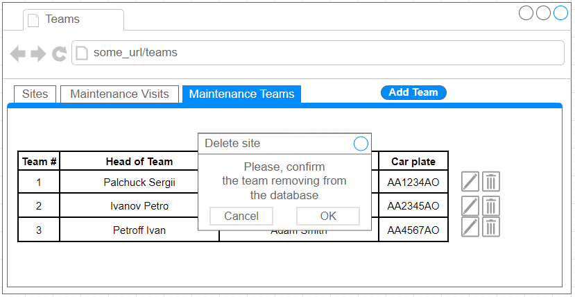

# Maintenance Accounting

## Vision

„Maintenance Accounting“ is a web-application that allows users to account the information about the maintenance of Physical protection system at the sites.
 
Application should provide next:  
- Storing of information about sites, maintenance visits and maintenance teams in database;
- Displaying the list of sites;
- Updating the sites list (editing site info, removing or adding sites);
- Displaying the list of maintenance visits;
- Updating the maintenance visits list (editing visit info, removing or adding visits);
- Displaying the list of maintenance teams;
- Updating the maintenance teams list (editing team info, removing or adding teams);
- Filtering by date for visits;
- Filtering by the number of remaining visits for sites.

## 1. Sites

### 1.1 Displaying the list of sites

This mode is designed to view the list of sites. It is possible to display only sites that a specified number of remaining maintenance visits.

***Main scenario:***  
- User clicks on “Sites” button;
- Application displays list of sites.

  
Pic. 1.1 View of Sites list

The list has following columns:  
- Site name – the name of the site where the Physical Protection System (PPS) has been installed;
- Task order – unique number for the warranty and maintenance contract;
- Start of warranty period – date when the warranty of PPS start; 
- Number of visits in contract – the number of quarterly maintenance visits in the contract;
- Number of visits done – the number of quarterly maintenance visits that were already done;
- Date of last visit – the date of last quarterly maintenance visit.

***Filtering by number of visits remain:***  
- In the Sites list view mode, the user sets the numbers in the forms and clicks on the "Search” button;
- The application will display the sites that satisfy entered condition of remaining visits number.

### 1.2 Add site

***Main scenario:***  
- User clicks on the “Add Site” button;
- Application displays form to enter Site data;
- User enters Site data and clicks on “Save” button;
- If any data were entered incorrectly, incorrect data messages are displayed;
- If all data were valid, the record is adding to database;
- If error occurs, then error message is displaying; 
- If new Site record is successfully added, then list of Sites with added record is displaying.

***Cancel operation scenario:***  
- User clicks on the “Add Site” button;
- Application displays form to enter Site data;
- User enters Site data and clicks on “Cancel” button;
- Data don’t save in database, then list of Sites records is displaying to user;
- If the user selects the menu item "Sites”, ” Maintenance Visits” or "Maintenance Teams", the data will not be saved to the database and the corresponding view of data will be opened.

  
Pic 1.2 Add Site.

When adding a Site, the following details are entered:  
- Site name – the name of the site;
- Task order – the number which indicates the unique number of the Site;
- Start of warranty period – the date when the warranty of physical protection system begins;
- Number of visits in Contract – the number of quarterly maintenance visits contracted for this Site.

Constraints for data validation:  
- Site name – maximum length of 90 characters;
- Task order – maximum value is 999, minimal value is 1;
- Start of warranty period – date in format dd/mm/yyyy;
- Number of visits in Contract – minimal value is 4.

### 1.3 Edit Site.

***Main scenario:***  
- User clicks on the “Edit” button, to the right of the site record;
- Application displays form to edit Site data;
- User edits Site data and clicks on “Save” button;
- If any data were entered incorrectly, incorrect data messages are displayed;
- If all data were valid, the record is updating in the database;
- If error occurs, then error message is displaying; 
- If the Site record is successfully edited, then list of Sites with updated record is displaying.

***Cancel operation scenario:***  
- User clicks on the “Edit” button, to the right of the site record;
- Application displays form to edit Site data;
- User edits Site data and clicks on “Cancel” button;
- Data don’t save in database, then list of Sites records is displaying to user;
- If the user selects the menu item "Sites”, ”Maintenance Visits” or "Maintenance Teams", the data will not be saved to the database and the corresponding view of data will be opened.

  
Pic 1.3 Edit Site.

***When editing a Site, the following details are entered:***  
- Site name – the name of the site;
- Task order – the number which indicates the unique number of the Site;
- Start of warranty period – the date when the warranty of physical protection system begins;
- Number of visits in Contract – the number of quarterly maintenance visits contracted for this Site.

***Constraints for data validation:***  
- Site name – maximum length of 90 characters;
- Task order – maximum value is 999, minimal value is 1;
- Start of warranty period – date in format dd/mm/yyyy;
- Number of visits in Contract – minimal value is 4.

### 1.4 Removing the Site

***Main scenario:***  
- The user, while in the list of Sites, presses the "Delete" button in the selected site line; 
- A confirmation dialog is displayed; 
- The user confirms the removal of the site; 
- Record is deleted from database; 
- If error occurs, then error message displays; 
- If site record is successfully deleted, then list of sites without deleted record is displaying.

  
Pic 1.4 Delete site dialog.

***Cancel operation scenario:***  
- The user, while in the list of Sites, presses the "Delete" button in the selected site line; 
- A confirmation dialog is displayed; 
- User press “Cancel” button; 
- List of sites without changes is displaying.

## 2. Maintenance Visits

### 2.1 Displaying the list of Maintenance Visits

This mode is designed to view the list of Maintenance Visits. It is possible to display only Visits that were conducted in a specified period of time.

***Main scenario:***  
- User clicks on “Maintenance Visits” button;
- Application displays list of Maintenance Visits.

  
Pic. 2.1 View of Maintenance Visits list

The list has following columns:  
- Date of visit – the date of quarterly maintenance visit;
- Head of Team – the name of Team head;
- Site name – the name of the site that was visited;
- Task order – unique number for the warranty and maintenance contract;
- Deliverable – the name of deliverable according to the warranty and maintenance contract.

***Filtering by the date of visit:***  
- In the Maintenance Visits list view mode, the user sets a time period in the forms and clicks on the "Search” button;
- The application will display the sites that satisfy entered time period.

### 2.2 Add Maintenance Visit

***Main scenario:***  
- User clicks on the “Add Visit” button;
- Application displays form to enter Maintenance Visit data;
- User enters Maintenance Visit data and clicks on “Save” button;
- If any data were entered incorrectly, incorrect data messages are displayed;
- If all data were valid, the record is adding to database;
- If error occurs, then error message is displaying; 
- If new Maintenance Visit record is successfully added, then list of Maintenance Visits with added record is displaying.

***Cancel operation scenario:***  
- User clicks on the “Add Visit” button;
- Application displays form to enter Maintenance Visit data;
- User enters Maintenance Visit data and clicks on “Cancel” button;
- Data don’t save in database, then list of Maintenance Visits records is displaying to user;
- If the user selects the menu item "Sites”, ” Maintenance Visits” or "Maintenance Teams", the data will not be saved to the database and the corresponding view of data will be opened.

  
Pic 2.2 Add Maintenance Visit.

When adding a Maintenance Visit, the following details are entered:  
- Date of visit – the date when visit was conducted;
- Task order – the number which indicates the unique number of the Site;
- Team # – the number which indicates the unique number of the Maintenance Team;
- Deliverable – the name of the deliverable defined for this visit according to the contracted for this Site.

Constraints for data validation:  
- Date of the visit – should be not later than current date;
- Deliverable – maximum length of 8 characters.

### 2.3 Edit Maintenance Visit.

***Main scenario:***  
- User clicks on the “Edit” button, to the right of the Maintenance Visit record;
- Application displays form to edit Maintenance Visit data;
- User edits Maintenance Visit data and clicks on “Save” button;
- If any data were entered incorrectly, incorrect data messages are displayed;
- If all data were valid, the record is updating in the database;
- If error occurs, then error message is displaying; 
- If the Maintenance Visit record is successfully edited, then list of Maintenance Visits with updated record is displaying.

***Cancel operation scenario:***  
- User clicks on the “Edit” button, to the right of the Maintenance Visit record;
- Application displays form to edit Maintenance Visit data;
- User edits Maintenance Visit data and clicks on “Cancel” button;
- Data don’t save in database, then list of Maintenance Visits records is displaying to user;
- If the user selects the menu item "Sites”, ”Maintenance Visits” or "Maintenance Teams", the data will not be saved to the database and the corresponding view of data will be opened.

  
Pic 2.3 Edit Maintenance Visit.

When editing a Maintenance Visit, the following details are entered:  
- Date of visit – the date when visit was conducted;
- Task order – the number which indicates the unique number of the Site;
- Team # – the number which indicates the unique number of the Maintenance Team;
- Deliverable – the name of the deliverable defined for this visit according to the contracted for this Site.

Constraints for data validation:  
- Date of the visit – should be not later than current date;
- Deliverable – maximum length of 8 characters.

### 2.4 Removing the Maintenance Visit

***Main scenario:***  
- The user, while in the list of Maintenance Visits, presses the "Delete" button in the selected Maintenance Visit line; 
- A confirmation dialog is displayed; 
- The user confirms the removal of the Maintenance Visit; 
- Record is deleted from database; 
- If error occurs, then error message displays; 
- If Maintenance Visit record is successfully deleted, then list of Maintenance Visits without deleted record is displaying.

  
Pic 2.4 Delete Maintenance Visit dialog.

***Cancel operation scenario:***  
- The user, while in the list of Maintenance Visits, presses the "Delete" button in the selected Maintenance Visit line; 
- A confirmation dialog is displayed; 
- User press “Cancel” button; 
- List of Maintenance Visits without changes is displaying.

## 3. Maintenance Teams

### 3.1 Displaying the list of Maintenance Teams

This mode is designed to view the list of Maintenance Teams. 

***Main scenario:***  
- User clicks on “Maintenance Teams” button;
- Application displays list of Maintenance Teams.
 
  
Pic. 3.1 View of Maintenance Teams list

The list has following columns:  
- Team # – unique number for the Maintenance Team;
- Head of Team – the name of Team head
- Assistant – the name of the second member of the team;
- Car plate – unique number that is written on the car plate of the car used by the team during the maintenances.

### 3.2 Add Maintenance Team

***Main scenario:***  
- User clicks on the “Add Team” button;
- Application displays form to enter Maintenance Team data;
- User enters Maintenance Team data and clicks on “Save” button;
- If any data were entered incorrectly, incorrect data messages are displayed;
- If all data were valid, the record is adding to database;
- If error occurs, then error message is displaying; 
- If new Maintenance Team record is successfully added, then list of Maintenance Teams with added record is displaying.

***Cancel operation scenario:***  
- User clicks on the “Add Team” button;
- Application displays form to enter Maintenance Team data;
- User enters Maintenance Team data and clicks on “Cancel” button;
- Data don’t save in database, then list of Maintenance Teams records is displaying to user;
- If the user selects the menu item "Sites”, ” Maintenance Visits” or "Maintenance Teams", the data will not be saved to the database and the corresponding view of data will be opened.
 
  
Pic 3.2 Add Maintenance Team.

When adding a Maintenance Team, the following details are entered:
- Team # – unique number for the Maintenance Team;
- Head of Team – the name of Team head
- Assistant – the name of the second member of the team;
- Car plate – unique number that is written on the car plate of the car used by the team during the maintenances.

Constraints for data validation:
- Team # – should be unique number;
- Head of Team – maximum length of 90 characters;
- Assistant – maximum length of 90 characters;
- Car plate – unique, maximum length of 8 characters.

### 3.3 Edit Maintenance Team.

***Main scenario:***  
- User clicks on the “Edit” button, to the right of the Maintenance Team record;
- Application displays form to edit Maintenance Team data;
- User edits Maintenance Team data and clicks on “Save” button;
- If any data were entered incorrectly, incorrect data messages are displayed;
- If all data were valid, the record is updating in the database;
- If error occurs, then error message is displaying; 
- If the Maintenance Team record is successfully edited, then list of Maintenance Teams with updated record is displaying.

***Cancel operation scenario:***  
- User clicks on the “Edit” button, to the right of the Maintenance Team record;
- Application displays form to edit Maintenance Team data;
- User edits Maintenance Team data and clicks on “Cancel” button;
- Data don’t save in database, then list of Maintenance Teams records is displaying to user;
- If the user selects the menu item "Sites”, ”Maintenance Visits” or "Maintenance Teams", the data will not be saved to the database and the corresponding view of data will be opened.
 
  
Pic 3.3 Edit Maintenance Team.

When adding a Maintenance Team, the following details are entered:
- Team # – unique number for the Maintenance Team;
- Head of Team – the name of Team head
- Assistant – the name of the second member of the team;
- Car plate – unique number that is written on the car plate of the car used by the team during the maintenances.

Constraints for data validation:
- Team # – should be unique number;
- Head of Team – maximum length of 90 characters;
- Assistant – maximum length of 90 characters;
- Car plate – unique, maximum length of 8 characters..

### 3.4 Removing the Maintenance Team

***Main scenario:***  
- The user, while in the list of Maintenance Teams, presses the "Delete" button in the selected Maintenance Team line; 
- A confirmation dialog is displayed; 
- The user confirms the removal of the Maintenance Team; 
- Record is deleted from database; 
- If error occurs, then error message displays; 
- If Maintenance Team record is successfully deleted, then list of Maintenance Teams without deleted record is displaying.
 
  
Pic 3.4 Delete Maintenance Team dialog.

***Cancel operation scenario:***  
- The user, while in the list of Maintenance Teams, presses the "Delete" button in the selected Maintenance Team line; 
- A confirmation dialog is displayed; 
- User press “Cancel” button; 
- List of Maintenance Teams without changes is displaying.

